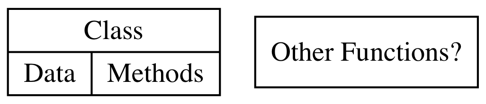
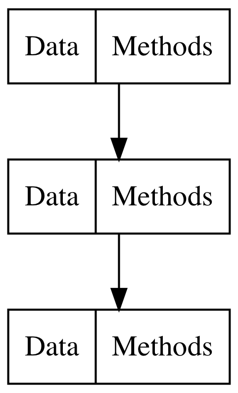
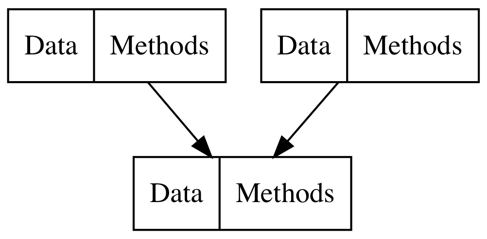
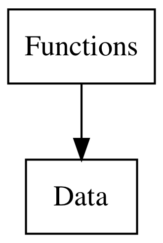
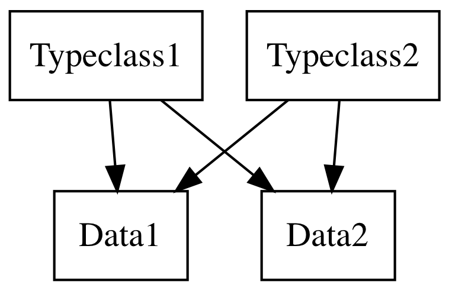
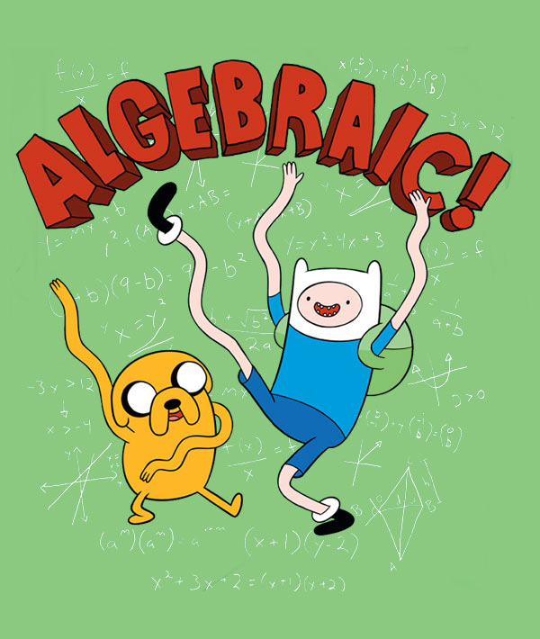

build-lists: true
theme: Poster, 1
background-color: #0F0E0E
text: #FF5481
header: #FF5481
text-emphasis: #FFFFFF
text-strong: #FF5481
code: auto(25)


# [fit] Functional Programming

### __*liek y tho?*__

-------------------------------------------------------------------------------

# [fit] Immutable Data

^ Strings, Ints, etc.

-------------------------------------------------------------------------------

Immutability brings confidence

-------------------------------------------------------------------------------

I __think__ this hasn't changed 

-------------------------------------------------------------------------------

I ~~__think__~~ *know* this hasn't changed

-------------------------------------------------------------------------------

*immutability* makes coordinating *concurrency* easier

^ If state can't change it can be shared across threads without fear

^ updates are calculated then are merged into a single thread (actor pattern)

-------------------------------------------------------------------------------

Avoids *defensive copying*

-------------------------------------------------------------------------------

Avoids *race conditions* in async workflows
__or at least forces you to handle them__

-------------------------------------------------------------------------------

Downsides?

- Speed? 
- Memory?
- Algorithms?

-------------------------------------------------------------------------------

##  Solution: 

#  ST Monad

-------------------------------------------------------------------------------

# [fit] Purity 
##  & 
# [fit] Types

^ Think of unix pipelines


-------------------------------------------------------------------------------

```java
public static int add(int a, int b){...}
```

```haskell
add :: Int -> Int -> Int
```

-------------------------------------------------------------------------------

```haskell
doSomethingComplicated :: [Int] -> String
```

-------------------------------------------------------------------------------

```haskell
doSomethingComplicated :: [Int] -> String
doSomethingComplicated :: [Int] -> IO String
```

-------------------------------------------------------------------------------

```haskell
doSomethingComplicated :: [Int] -> String
doSomethingComplicated :: [Int] -> IO String
doSomethingComplicated :: MonadDatabase m => [Int] -> m String
```

-------------------------------------------------------------------------------

```haskell
doSomethingComplicated :: [Int] -> String
doSomethingComplicated :: [Int] -> IO String
doSomethingComplicated :: MonadDatabase m => [Int] -> m String
doSomethingComplicated :: [Int] -> Reader Config String
```

-------------------------------------------------------------------------------

No nulls!
No (hidden) exceptions!
Known side-effects!

-------------------------------------------------------------------------------

# [fit] Hoogle 
# [fit] demo!

-------------------------------------------------------------------------------

Pure functions are

- Easier to reason about
- Easier to combine/compose
- Easier to test
- Easier to parallelize

-------------------------------------------------------------------------------

## [fit] Memoization

-------------------------------------------------------------------------------

## [fit] Laziness

-------------------------------------------------------------------------------

## [fit] Optimization 

-------------------------------------------------------------------------------

# Currying

```haskell
addSuffix :: String -> String -> String
addSuffix suffix str = str ++ suffix

getExcited :: String -> String
getExcited = addSuffix "!!"

getExcited "Hello, world"
> "Hello, world!!"
```

-------------------------------------------------------------------------------

```haskell
addInterest :: Float -> Float
addInterest = (* 0.14)
```

-------------------------------------------------------------------------------

```haskell
max :: Int -> Int -> Int
max a b = if a > b then a else b

restrictToPositive :: Int -> Int
restrictToPositive = max 0
```

-------------------------------------------------------------------------------

```haskell
type String = [Char]
toUpper :: Char -> Char

upperCase :: String -> String
upperCase = map toUpper
```

-------------------------------------------------------------------------------

```haskell
isNumber :: String -> Bool
isNumber = matches "\d+"
```

-------------------------------------------------------------------------------

# Higher Order Functions

-------------------------------------------------------------------------------

Greater code re-use 
&
Separation of concerns

-------------------------------------------------------------------------------

```haskell
collectEvens :: [Int] -> [Int]
collectPositive :: [Int] -> [Int]
removeEmpty :: [String] -> [String]
```

-------------------------------------------------------------------------------

```haskell
filter :: (a -> Bool) -> [a] -> [a]
collectEvens = filter even
collectPositive = filter (>0)
removeEmpty = filter (not . (== 0) . length)
```

-------------------------------------------------------------------------------

```javascript
const timesTen = [1,2,3].map(x => x * 10)
```

vs

```javascript
const numbers = [1,2,3]
const timesTen = []
for (var i = 0, i < numbers.length; i++) {
    timesTen.push(numbers[i] * 10)
}
```

-------------------------------------------------------------------------------

Separates *what you want to do* from *how that thing is done*.

-------------------------------------------------------------------------------

Many operations have many levels of semantics

-------------------------------------------------------------------------------

"I want to do print every user":

- what: `print` 
- where: `every user`

These parts can be written separately for easier re-use!

-------------------------------------------------------------------------------

# Parametricity

Helps with correctness!

```haskell
identity :: a -> a

-- Could edit the strings or something!
intTail :: [Int] -> [Int]

-- Can't change the contents at all!
tail :: [a] -> [a]
```

-------------------------------------------------------------------------------

Find more general solutions to common problems!

```haskell
sequenceA :: (Traversable t, Applicative f) => t (f a) -> f (t a)

Promise.all :: [Promise a] -> Promise [a]
forkJoin :: [Observable a] -> Observable [a]
```

-------------------------------------------------------------------------------

# Hierarchy

-------------------------------------------------------------------------------

Traditional Hierarchy



-------------------------------------------------------------------------------

Classes



-------------------------------------------------------------------------------

Classes



-------------------------------------------------------------------------------

Functions



-------------------------------------------------------------------------------

Typeclass Hierarchy 



-------------------------------------------------------------------------------


# Algebraic datatypes

```haskell
data PaymentType = CreditCardNumber Int 
                 | IOU String 
                 | Cash Int
```

-------------------------------------------------------------------------------

Pattern matching

```haskell
handlePayment :: Int -> PaymentType -> IO ()
handlePayment amt (CreditCardNumber cardNumber) = ...
handlePayment amt (IOU name) = ...
handlePayment amt (Cash cashAmt) = ...
```

Compiler can enforce that we handled all cases!

-------------------------------------------------------------------------------



-------------------------------------------------------------------------------

# Programmable Semicolons!

-------------------------------------------------------------------------------

## Intro to Maybe

```haskell
data Maybe a = Just a | Nothing
```

-------------------------------------------------------------------------------

```haskell
findUser :: UserId -> Maybe User
getPhoneNumber :: User -> Maybe String

getUserPhone ::  UserId -> Maybe String
getUserPhone userID = do
  user <- findUser userID
  getPhoneNumber user
```

-------------------------------------------------------------------------------

```haskell
fetchUser :: UserId -> Async User
getUserAccount :: User -> Async Account
chargeAccount :: Int -> Account -> Async Bool

chargeUserAccount ::  UserId -> Int -> Async Bool
getUserPhone userID amount = do
  user <- fetchUser userID
  account <- getUserAccount user
  chargeAccount amount account
```

-------------------------------------------------------------------------------

```haskell
filterAndMultiply = do
    n <- [1..10]
    guard (even n)
    return (n * 10)

λ> filterAndMultiply
[20,40,60,80,100]

λ> [ n * 10 | n <- [1..10], even n]
[20,40,60,80,100]
```

-------------------------------------------------------------------------------

# Generic Programming

```haskell
data User = 
    User { name :: String
         , age :: Int
         } deriving (Eq, Show, Generic)

instance ToJSON User
instance FromJSON User
instance Serialize User
instance PrettyPrint User
```

-------------------------------------------------------------------------------

# Summary

FP principles combine well together to provide a 
*foundation* 
for programming with more 
__clarity__ 
and __confidence__ 

while affording optimization and abstraction without cost.
